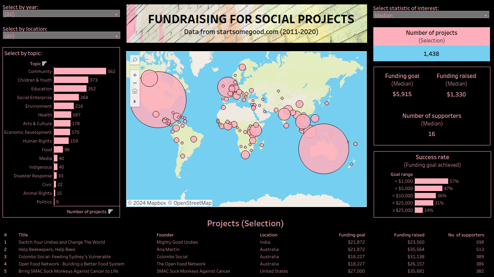

# Trends and opportunities in fundraising for social projects
## Midterm project by Sebastian Bobeth and Juliane Petersen
- Ironhack Data Analytics Bootcamp, Berlin, November 2023
- Type: BI project
- Project status: Finalized

## Project description
#### Project aim
To provide a consulting service for social entrepreneurs seeking to pitch their project on fundraising platforms. We developed an overview of trends and success criteria by conducting explorative data analysis (EDA) on the following features:
- Categories/topics
- Project location
- Funding targets (numerical and in ranges)
- Funding raised (absolute and relative to funding target)
- Number of supporters
- Project description length.   

As it was our visualization aim, we created an interactive dashboard targeted at aspiring social entrepreneurs that integrated this information.

#### Tech used
- Python, Jupyter Notebook (Data wrangling, explorative data analysis)
- SQL (Model building)
- Tableau (Explorative data analysis, data visualization, interactive dashboard creation & publication)

#### Overview of the project week
| Day       | Activities                                                                 |
| --------- | -------------------------------------------------------------------------- |
| Monday    | Project pitch  Data wrangling  Exploratory data analysis           |
| Tuesday   | Exploratory data analysis  Selection of meaningful results             |
| Wednesday | Data visualization  Final selections for dashboard & presentation      |
| Thursday  | Preparation of dashboard & presentation  Finalizing deliverables       |
| Friday    | Presentation  Publication of dashboard  Submission of deliverables |

## Dashboard
You can find our developed dashboard [here on Tableau Public](https://public.tableau.com/app/profile/sebastian.bobeth/viz/fundraising_social_projects_dashboard/DASHBOARD). Currently, it is optimized for desktop users. You can see a preview below.  
 

## About the dataset
- Title: “Social entrepreneurship database with venture identification, linguistic variables and fundraising success.”
- Author: Donal Crilly (Professor of Strategy and Entrepreneurship, London Business School)
- Year: 2020
- Context of origin: Research project "Metaphor as the Purpose of the Firm (METAPoF)", conducted under European Research Council Consolidator Grant (CoG), SH1, ERC-2018-COG
- Original shape: 1474 rows, 105 columns
- Links: [Website](https://lbsresearch.london.edu/id/eprint/1553/), [Dataset](https://lbsresearch.london.edu/id/eprint/1553/1/Social_enterpreneurship_data_with_venture_identification_linguistic_variables_and_fundraising_success.xlsx)
